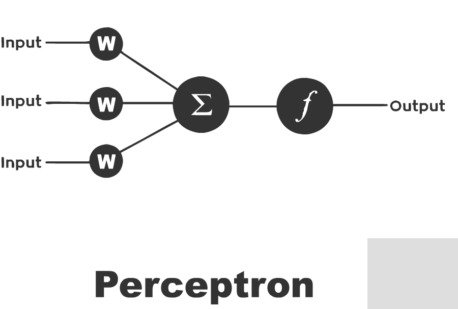
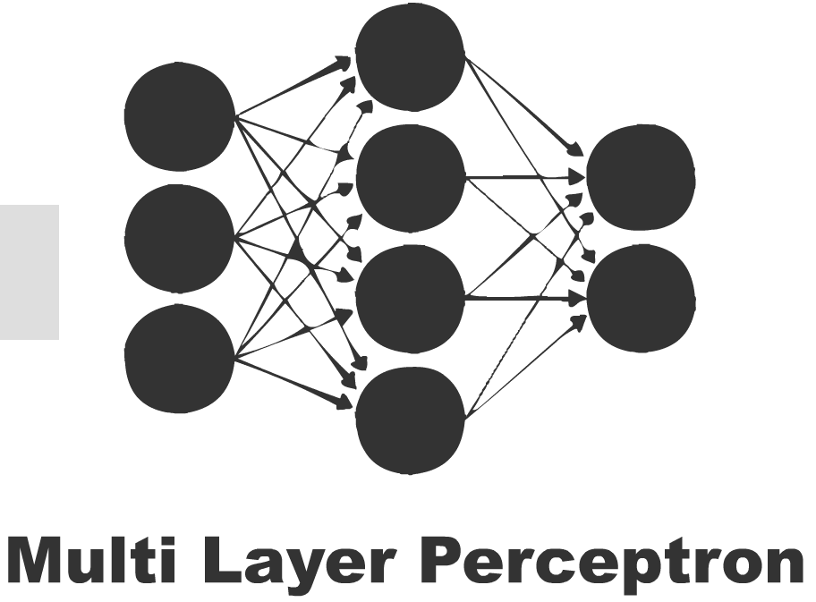
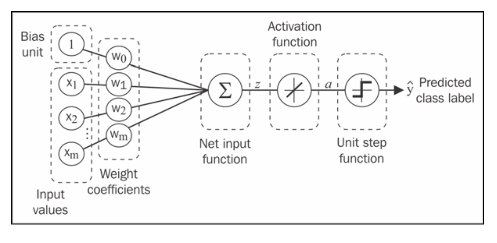
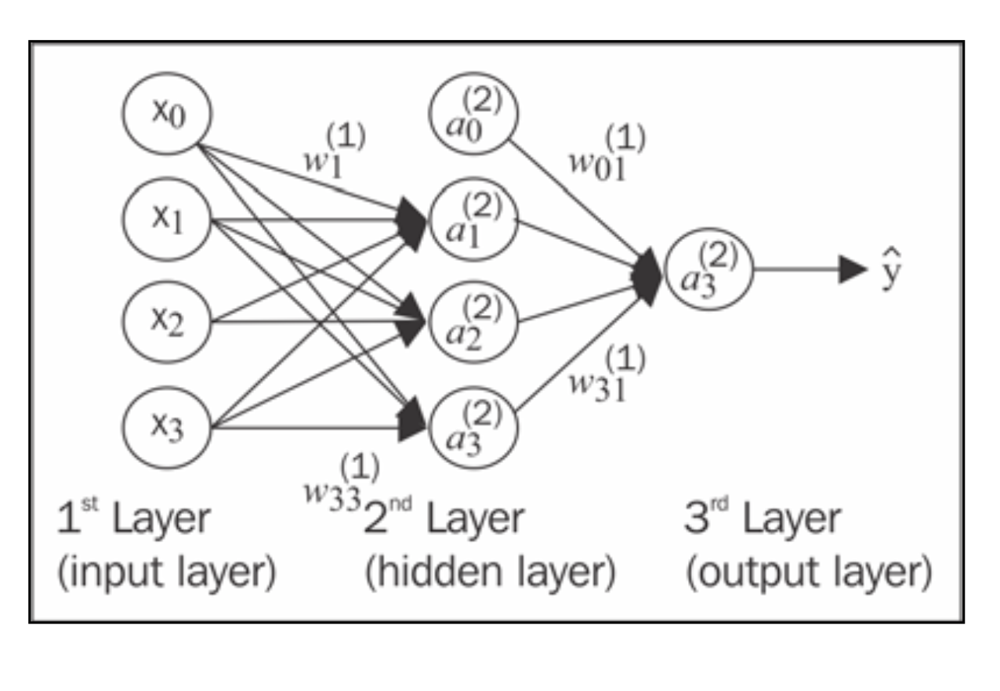
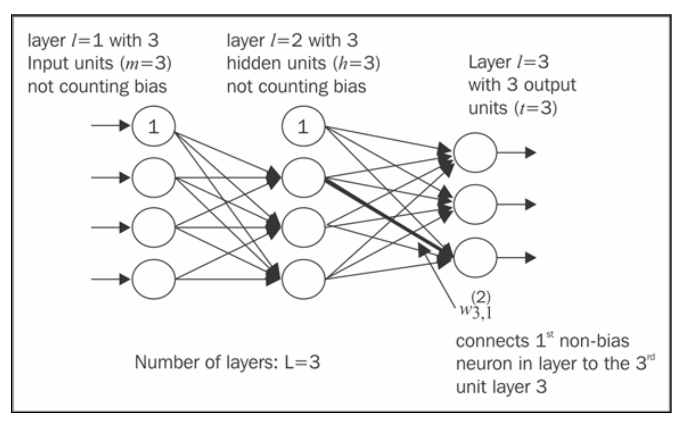
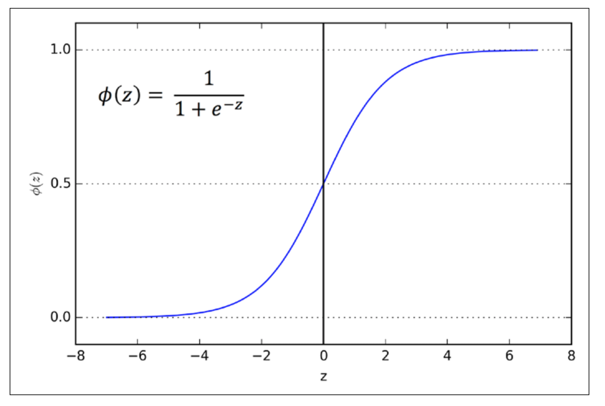
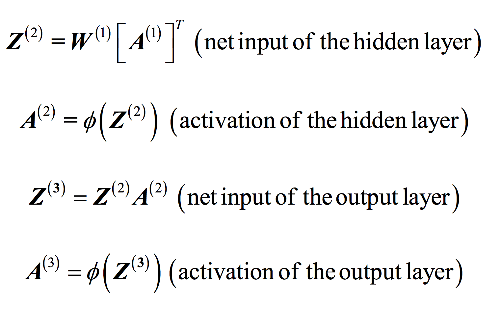
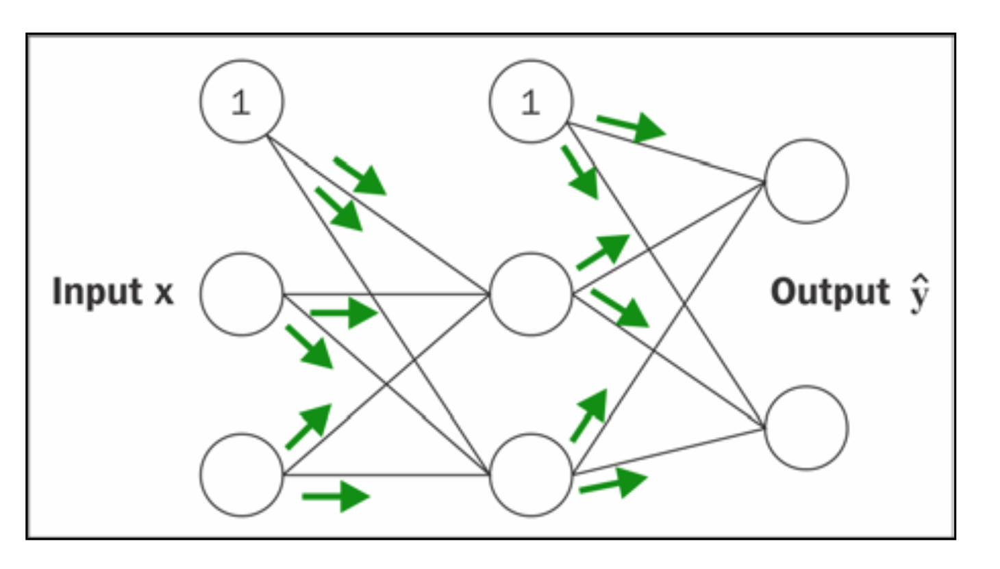
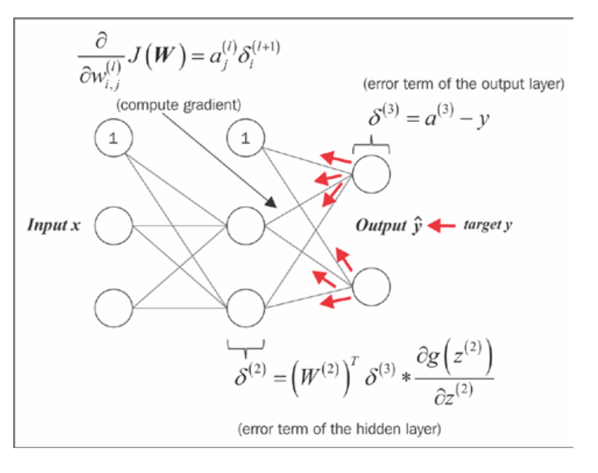
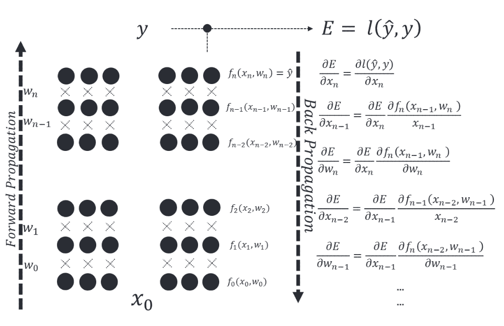

# Introduction to Deep Learning
딥러닝을 통해 여러 레이어으로 구성된 모델을 활용하여 다양한 데이터를 학습할 수 있습니다. 이러한 방법은 음성인식, 시각적 개체 인식, 개체 탐지 등 다양한 영역에서 최첨단 기술을 발전시켰습니다.

# This Section will cover:
- 다중신경망(NN)에 대한 이론적 이해
- 이미지분류 학습
- Backpropagation 알고리즘 구현
- 디버깅
## Building Blocks: Artificial Neural Networks (ANN)
- 기계 학습 및 인지과학에서 인공신경망(ANN)은 생물학적 신경망에서 영감을 받은 네트워크
- 특징 벡터와 타겟 벡터 사이에 레이어
<p align = 'center'></p>

- Perceptron은 이진분류의 지도학습에 사용되는 알고리즘
- 벡터로 표현된 인풋이 어떤 클래스에 속하는지 여부를 결정

- 로지스틱 회귀와 마찬가지로 신경망의 가중치는 합산된 입력 벡터로 곱해지고, 활성화 함수의 입력에 공급
- 다중 계층을 갖도록 설계될 수 있음(다중 계층 퍼셉트론(MLP라고도 함))
<p align = 'center'></p>


### Single Layer Neural Network
<p align = 'center'>
    
</p>
(Source: Python Machine Learning, S. Raschka)

## Weights Update Rule
- 모델의 가중치 계수를 학습하기 위해 경사하강법 최적화 알고리즘을 사용
<br><br>
- **epoch**마다 가중치 벡터(w) 업데이트
$$
w = w + \Delta w, \text{where } \Delta w = - \eta \nabla J(w)
$$

<br><br>
즉, 전체 훈련 세트를 기반으로 기울기를 계산하고 기울기 $\nabla J(w)$의 **반대 방향**으로 한 걸음 더 나아가 모델의 가중치를 업데이트했습니다.

모델의 최적 가중치를 찾기 위해 목적 함수(예: SSE(Sum of Squared Errors)) 비용 함수 J(w)를 최적화했습니다.

더욱이, 우리는 학습 속도 $\eta$ 라는 요인으로 기울기를 곱합니다. 이 값은 **학습 속도**와 cost function의 전역 최소값을 초과할 위험의 균형을 맞추기 위해 신중하게 선택합니다.

### Gradient Descent
**gradient descent optimization**에서는 각 epoch가 종료된 후 모든 가중치를 동시에 업데이트하고 가중치 벡터(w)의 가중치값($w_i$)에 대한 편미분을 다음과 같이 정의한다.

$$
\frac{\partial}{\partial w_j} J(w) = \sum_{i} ( y^{(i)} - a^{(i)} )  x^{(i)}_j
$$

**Note**: 위 첨자 $(i)$는 i번째 샘플을 나타냅니다. 아래 첨자 $j$는 j번째 차원/특성_을 나타냅니다.

여기서 $y^{(i)}$는 특정 샘플 $x^{(i)}$의 target 클래스 레이블이고 $a^{(i)}$는 뉴런의 **activation(활성화함수)**입니다.

(which is a linear function in the special case of _Perceptron_).
We define the **activation function** $\phi(\cdot)$ as follows:

$$
\phi(z) = z = a = \sum_{j} w_j x_j = \mathbf{w}^T \mathbf{x}
$$
### Binary Classification
While we used the **activation** $\phi(z)$ to compute the gradient update, we may use a **threshold function** _(Heaviside function)_ to squash the continuous-valued output into binary class labels for prediction:

$$
\hat{y} = 
\begin{cases}
    1 & \text{if } \phi(z) \geq 0 \\
    0 & \text{otherwise}
\end{cases}
$$
## Building Neural Nets from scratch 

### Idea:

We will build the neural networks from first principles. 
We will create a very simple model and understand how it works. We will also be implementing backpropagation algorithm. 

**Please note that this code is not optimized and not to be used in production**. 

This is for instructive purpose - for us to understand how ANN works. 

Libraries like `theano` have highly optimized code.
### Perceptron and Adaline Models

Take a look at this notebook : <a href="1.1.1 Perceptron and Adaline.ipynb" target="_blank_"> Perceptron and Adaline </a>
If you want a sneak peek of alternate (production ready) implementation of _Perceptron_ for instance try:
```python
from sklearn.linear_model import Perceptron
```
## Introducing the multi-layer neural network architecture


_(Source: Python Machine Learning, S. Raschka)_
Now we will see how to connect **multiple single neurons** to a **multi-layer feedforward neural network**; this special type of network is also called a **multi-layer perceptron** (MLP). 

The figure shows the concept of an **MLP** consisting of three layers: one _input_ layer, one _hidden_ layer, and one _output_ layer. 

The units in the hidden layer are fully connected to the input layer, and the output layer is fully connected to the hidden layer, respectively. 

If such a network has **more than one hidden layer**, we also call it a **deep artificial neural network**.

### Notation
we denote the `ith` activation unit in the `lth` layer as $a_i^{(l)}$ , and the activation units $a_0^{(1)}$ and 
$a_0^{(2)}$ are the **bias units**, respectively, which we set equal to $1$. 
<br><br>
The _activation_ of the units in the **input layer** is just its input plus the bias unit:

$$
\mathbf{a}^{(1)} = [a_0^{(1)}, a_1^{(1)}, \ldots, a_m^{(1)}]^T = [1, x_1^{(i)}, \ldots, x_m^{(i)}]^T
$$
<br><br>
**Note**: $x_j^{(i)}$ refers to the jth feature/dimension of the ith sample
### Notes on Notation (usually) Adopted

The terminology around the indices (subscripts and superscripts) may look a little bit confusing at first. 
<br><br>

You may wonder why we wrote $w_{j,k}^{(l)}$ and not $w_{k,j}^{(l)}$ to refer to 
the **weight coefficient** that connects the *kth* unit in layer $l$ to the jth unit in layer $l+1$. 
<br><br>

What may seem a little bit quirky at first will make much more sense later 


_(Source: Python Machine Learning, S. Raschka)_when we **vectorize** the neural network representation. 
<br><br>

For example, we will summarize the weights that connect the input and hidden layer by a matrix 
$$ W^{(1)} \in \mathbb{R}^{h×[m+1]}$$

where $h$ is the number of hidden units and $m + 1$ is the number of hidden units plus bias unit. 
we denote the `ith` activation unit in the `lth` layer as $a_i^{(l)}$ , and the activation units $a_0^{(1)}$ and 
$a_0^{(2)}$ are the **bias units**, respectively, which we set equal to $1$. 
<br><br>
The _activation_ of the units in the **input layer** is just its input plus the bias unit:

$$
\mathbf{a}^{(1)} = [a_0^{(1)}, a_1^{(1)}, \ldots, a_m^{(1)}]^T = [1, x_1^{(i)}, \ldots, x_m^{(i)}]^T
$$
<br><br>
**Note**: $x_j^{(i)}$ refers to the jth feature/dimension of the ith sample
* Starting at the input layer, we forward propagate the patterns of the training data through the network to generate an output.

* Based on the network's output, we calculate the error that we want to minimize using a cost function that we will describe later.

* We backpropagate the error, find its derivative with respect to each weight in the network, and update the model.
### Sigmoid Activation


_(Source: Python Machine Learning, S. Raschka)_


_(Source: Python Machine Learning, S. Raschka)_


_(Source: Python Machine Learning, S. Raschka)_
## Backward Propagation
The weights of each neuron are learned by **gradient descent**, where each neuron's error is derived with respect to it's weight.


_(Source: Python Machine Learning, S. Raschka)_
Optimization is done for each layer with respect to the previous layer in a technique known as **BackPropagation**.

(*The following code is inspired from [these](https://github.com/dennybritz/nn-from-scratch) terrific notebooks*)